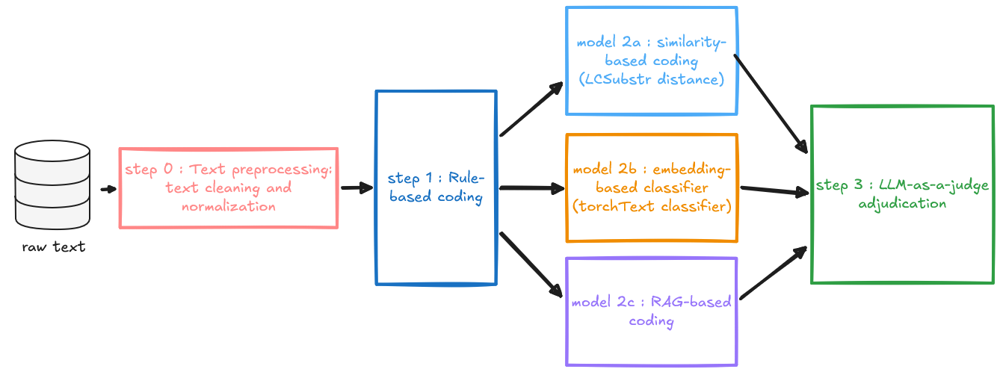
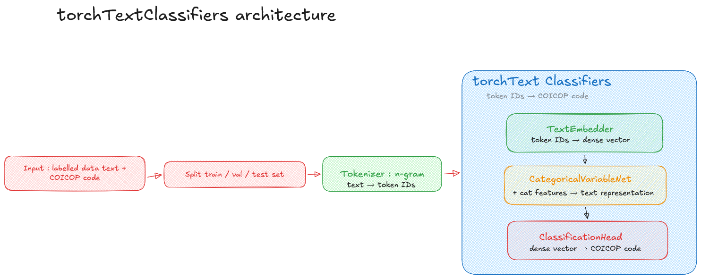
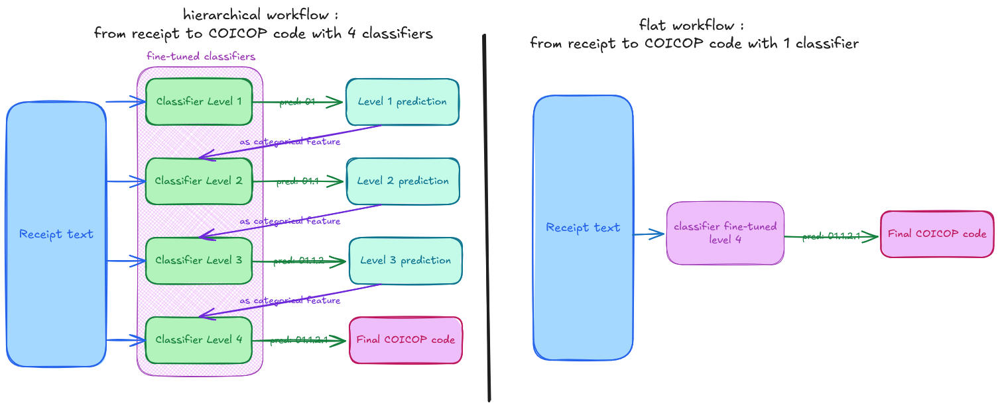
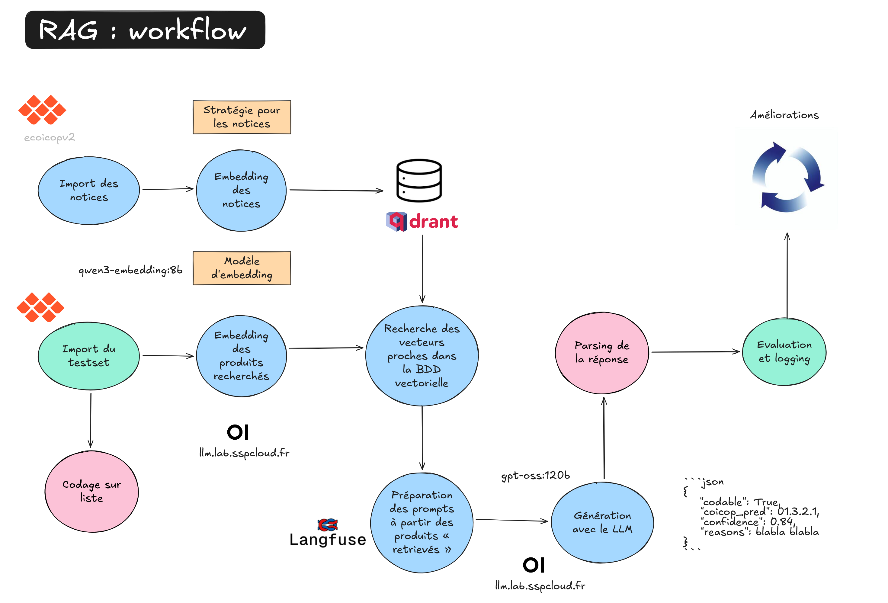

# 1. Context {#chapters_1 .backgroundTitre_violet}

## Some context elements {#section_1_1 .backgroundStandard_violet}

:::{.enteteAvecTitre}
Context
:::

::: {.columns}

::: {.column width="45%"}

**COICOP : Classification of Individual Consumption by Purpose**

- Hierarchical classification : on 5 levels → **we code at level 4**
- Assigning a code requires understanding both the **product** and its **purpose**

| Level | Example |
|-------|---------|
| 1 - Division | `01` - Food |
| 4 - Sub-class | `01.1.1.1` - Rice |

:::

::: {.column width="55%"}
**Household Budget Survey (HBS) : new wave in 2026**

- **Goal:** understand households expenditure (consumption basket)
- ~**70,000 distinct free-text labels** to code into COICOP

- New collection modes: smartphone, receipts, paper
- COICOP updated since 2017 → **limited reuse** of past labels
- Annotation team: **7 people → 1**

**Deadline: 6 months** to build a production-ready pipeline

:::

:::

::: {.notes}
The 2026 wave of the Household Budget Survey faces a perfect storm of constraints. The collection mode has been completely revised, generating labels from new sources — smartphones, scanned receipts, paper diaries — with different characteristics. The COICOP nomenclature was updated in 2018, so historical annotations are only partially reusable. The annotation team went from seven people to one. And the deadline is 6 months. Manual coding is simply not an option.
:::

## Key challenges {#section_1_2 .backgroundStandard_violet}

:::{.enteteAvecTitre}
Context
:::

::: {.columns}

::: {.column width="50%"}
**Classification**

- ~900 granular COICOP classes (all 5 levels)

**Labels**

- Heterogeneous textual inputs across sources
- Generic, ambiguous, or uninformative (*"various food"*, *"article"*)
- Same string can map to different codes depending on context

:::

::: {.column width="50%"}

**Annotation**

- Few annotated labels available (fewer human resources)
- Limited and unevenly distributed labelled data across COICOP divisions

**Tools**

- No GPU available on production servers
:::

:::

::: {.notes}
Before describing the pipeline, it's worth laying out the five dimensions that make this problem hard. The classification is highly granular and was updated, so past labels have limited reuse value. The multimode collection produces heterogeneous inputs. Many labels are too vague to code confidently. Annotated data is scarce and unevenly distributed. And production constraints rule out GPU-based inference.
:::

# 2. The Coding Methods {#chapters_2 .backgroundTitre_vert}

::: {.notes}
Let me now walk through the pipeline — first the overall architecture, then each method in turn.
:::

## Pipeline overview {#section_2_0 .backgroundStandard_vert}

:::{.enteteAvecTitre}
The Coding Methods
:::

{fig-align="center" width=90%}

::: {.notes}
Here's the overall pipeline. Raw product labels first pass through a rule-based pre-filter. Those that aren't caught are processed by three independent methods in parallel: LCS, TTC, and RAG. A final LLM-as-Judge step arbitrates between the three predictions. The pipeline runs as a DAG on Argo Workflows on the SSPCloud Kubernetes cluster, with data flowing via Parquet files on S3.
:::

## Method 1 - LCSubstr: leveraging historical annotations {#section_2_2 .backgroundStandard_vert}

:::{.enteteAvecTitre}
The Coding Methods
:::

::: {.columns}

::: {.column width="55%"}
**Principle**

- Compares each label against a **suggester**: a curated list of reliably coded labels with their validated COICOP code
- Returns the best match and its similarity score

:::

::: {.column width="45%"}

**Example** - *Query:* `"baguette"` (bread)

| Suggester candidate | Code | LCSubstr distance |
|---------------------|------|------------------|
| baguette | `01.1.1.1` | 0.0 |
| baguette en bois | `05.5.2` | 0.5 |

→ Best match (lowest distance): `01.1.1.1`

**Output**: top-1 candidate code + LCSubstr distance

:::

:::

::: {.notes}
The first ML method is LCSubstr similarity against a suggester — a ranked list of the most frequently annotated historical labels. We compute the LCSubstr distance in C with a parallelised, optimised implementation for performance at scale. The best match and its similarity score are passed downstream. The limit is novelty: a label with no close historical match will not be covered. That's where TTC and RAG come in.
:::

## Method 2 - TTC: embedding-based classifier {#section_2_3 .backgroundStandard_vert}

:::{.enteteAvecTitre}
The Coding Methods
:::

::: {.columns}

::: {.column width="55%"}
**torchText Classifiers : Architecture**

- Inspired by fastText
- Character n-gram tokenizer (3–6 grams) + 128-dim embedding
- **Flat** variant: direct level 4 COICOP prediction
- **Hierarchical** variant: cascade of 4 classifiers, one per COICOP level

:::

::: {.column width="45%"}
**Training data**

- Pre-trained on **~3M scanner data labels** (point-of-sale data), completed with **LLM-generated synthetic labels** for underrepresented COICOP classes
- Fine-tuned on **~10k HBS annotations**

**Output**: top-k predictions + confidence scores + word attributions

:::

:::

::: {.notes}
The TTC classifier is built on the torchTextClassifiers library — a fastText-inspired architecture using character n-gram embeddings. It tokenizes labels into 3 to 6 character grams, maps them through a 128-dimensional embedding layer, and predicts a COICOP code. The character-level representation makes it robust to the typos and abbreviations typical of survey data. It's served as a FastAPI service and produces calibrated confidence scores, which play a critical role in the LLM-as-Judge step.
:::

## {#section_2_3 .backgroundStandard_vert .unnumbered}

{fig-align="center" width=140% style="margin-top: 2em;"} 

## {#section_2_3 .backgroundStandard_vert .unnumbered}

{fig-align="center" width=140%} 

## Method 3 - RAG: semantic retrieval {#section_2_4 .backgroundStandard_vert}

:::{.enteteAvecTitre}
The Coding Methods
:::

::: {.columns}

::: {.column width="55%"}
**Principle**

- Embed the product label → retrieve the **top-10** most semantically similar COICOP codes from a **Qdrant** vector DB
- Inject candidates + their official COICOP notices into an LLM prompt → generate the predicted code (structured JSON)

:::

::: {.column width="45%"}
**Model choices** (deployed on vLLM)

- **Embedding**: Qwen3-Embedding-8B (vector size 4096d)
- **Generation**: Gemma4-26B-MoE (temperature 0.1), structured JSON output with reflection elements

**Output**: predicted COICOP code (JSON) + LLM self-confidence score
:::

:::

::: {.notes}
The third method is RAG. Offline, we build a semantic index of all COICOP code descriptions using a large embedding model served by vLLM. At inference time, we embed the product label, retrieve the most semantically close COICOP codes from Qdrant, and inject them plus their official descriptions into a generation prompt. This handles labels that don't match any historical annotation but whose meaning is clear to a language model. The official COICOP notices — inclusion rules, exclusion rules, examples — are the same reference material a human expert would use.
:::

## {#section_2_4 .backgroundStandard_vert .unnumbered}

{fig-align="center" width=80% style="margin-top: -3em;"} 

## Methods comparison {#section_2_5 .backgroundStandard_vert}

:::{.enteteAvecTitre}
The Coding Methods
:::

:::{.table-all-borders}
| | **LCSubstr** | **TTC** | **RAG** |
|---|---|---|---|
| Annotation burden | [**Low**]{style="color: #e67e22;"} | [**High**]{style="color: #c0392b;"} | [**None**]{style="color: #27ae60;"} |
| Process | [**No LLM, no GPU**]{style="color: #27ae60;"} | [**GPU training / no LLM at inference**]{style="color: #e67e22;"} | [**LLM + vector DB at inference**]{style="color: #e67e22;"} |
| Speed | [**Fast (parallelised C)**]{style="color: #27ae60;"} | [**Slow training / Fast at inference**]{style="color: #e67e22;"} | [**Slower (LLM generation)**]{style="color: #c0392b;"} |
| Quality signal | [**LCSubstr distance (0–1)**]{style="color: #e67e22;"} | [**Calibrated confidence score**]{style="color: #27ae60;"} | [**LLM self-reported confidence**]{style="color: #c0392b;"} |
| Explainability | [**Common substring**]{style="color: #27ae60;"} | [**Word attributions**]{style="color: #27ae60;"} | [**LLM self-reporting**]{style="color: #e67e22;"} |
| Accuracy L1 | [**67.5%**]{style="color: #c0392b;"} | [**87.6%**]{style="color: #27ae60;"} | [**82.7%**]{style="color: #e67e22;"} |
| Accuracy L4 | [**47.1%**]{style="color: #c0392b;"} | [**81.1%**]{style="color: #27ae60;"} | [**65.5%**]{style="color: #e67e22;"} |
:::

::: {.notes}
Each method has a distinct profile. LCS is fast and reliable when the label closely matches a known coded label, but fails on novel inputs. TTC is the strongest individual classifier, reaching 87.6% at L1 and 81.1% at L4, with no LLM at inference. RAG handles semantically new labels by leveraging COICOP descriptions, but depends on LLM generation at inference time. The LLM-as-Judge combines all three.
:::

# 3. LLM-as-Judge {#chapters_3 .backgroundTitre_bleu}

::: {.notes}
Once we have three sets of predictions, we need to decide which one to trust. That's the LLM-as-Judge step — and it's where we also address cost and infrastructure.
:::

## Arbitrating between methods {#section_3_1 .backgroundStandard_bleu}

:::{.enteteAvecTitre}
LLM-as-Judge
:::

::: {.columns}

::: {.column width="55%"}
**The arbitration step**

- Receives predictions + scores from **LCS**, **TTC**, **RAG**
- The LLM sees: the product label, shop context, the three candidates, and a filtered COICOP nomenclature (codes + labels)
- Selects the most appropriate code and returns a confidence score (1–5)

**Why LLM rather than majority vote?**

A vote counts voices but the LLM **weights quality signals** (confidence, distance) and uses the full purchase context to resolve what no method could distinguish alone.
:::

::: {.column width="45%"}
**Two cost-saving shortcuts**

1. **Consensus short-circuit** : if all three methods agree *and* TTC confidence ≥ 0.90 → **no LLM call**, prediction accepted directly
2. **Classification filtering** : only the relevant COICOP sections are injected → **4–10× fewer tokens**

:::

:::

::: {.notes}
The LLM-as-Judge step receives the three predictions and arbitrates. Two shortcuts keep costs under control. First, the consensus short-circuit: if all three agree and TTC confidence is above 90%, we skip the LLM entirely. Second, nomenclature filtering: instead of injecting all ~700 COICOP codes into every prompt, we filter to the relevant sections — cutting token counts by a factor of 4 to 10. The output is forced to be structured JSON for reliable parsing at scale.
:::

# 4. Results {#chapters_4 .backgroundTitre_jaune}

::: {.notes}
We now turn to how the pipeline performs — first the overall accuracy and coverage, then a breakdown by COICOP division.
:::

## Results {#section_4_1 .backgroundStandard_jaune}

:::{.enteteAvecTitre}
Results
:::

::: {.columns}

::: {.column width="45%"}

| Pipeline coding stage | Coverage |
|----------------------|---------:|
| **Step 1 - Regex** | |
| &emsp; Regex pattern | 8% |
| &emsp; Manual review flagged | 1% |
| **Step 2 - Three methods** | |
| &emsp; Consensus shortcut (no LLM call) | 7% |
| **Step 3 - LLM-as-Judge** | |
| &emsp; LLM-as-Judge arbitration | 84% |
| &emsp; *↳ of which: flagged for expert review* | *3.5%* |

:::

::: {.column width="55%"}
**Accuracy** *(~7,350 annotated labels)*

- **Human baseline: ~90% at L5** *(with internet access)*
- **Pipeline** *(no external lookup)*:
  - **L1: 90.0%** → consumption baskets *(best single method → TTC: 87.6%)*
  - **L4: 82.6%** → HBS team *(best single method → TTC: 81.1%)*
  - **L5: 79.4%** → Eurostat *(only the pipeline produces it)*

*Accuracy likely **underestimated**: ~10% known error rate in manual annotations (domain expert estimate).*

:::

:::

::: {.notes}
The hybrid ensemble outperforms every individual method. Per-method accuracy at L4: LCS 47.1%, RAG 65.5%, TTC 81.1% — pipeline 82.6%. At L1: LCS 67.5%, RAG 82.7%, TTC 87.6% — pipeline 90.0%. TTC is the strongest single method, but the pipeline adds ~1.5pp at L4 and is the only method producing L5 predictions (79.4%). The ~10pp gap vs human at L5 is partly explained by context asymmetry: human annotators can search the web; the pipeline runs on internal servers with no external access. Accuracy figures are conservative — ~10% of test annotations contain errors, so true pipeline accuracy is likely higher.
:::

## Accuracy by division {#section_4_2 .backgroundStandard_jaune}

:::{.enteteAvecTitre}
Results
:::

**Division-level (L1) accuracy over the ~7,350 annotated test labels**. Overall the pipeline lands in the correct COICOP division **90.0%** of the time, but accuracy and coverage vary widely between divisions.

::: {.columns style="font-size: 0.62em;"}

::: {.column width="50%"}
| Division (level 1) | n | Acc. L1 |
|---|---:|---:|
| **01** Food & non-alcoholic beverages | 3,591 | [97.9%]{style="color:#27ae60;"} |
| **02** Alcoholic bev., tobacco, narcotics | 130 | [94.6%]{style="color:#27ae60;"} |
| **03** Clothing & footwear | 241 | [87.1%]{style="color:#e67e22;"} |
| **04** Housing, utilities & fuels | 219 | [72.1%]{style="color:#c0392b;"} |
| **05** Furnishings & household equipment | 372 | [86.6%]{style="color:#e67e22;"} |
| **06** Health | 203 | [88.2%]{style="color:#e67e22;"} |
| **07** Transport | 422 | [94.1%]{style="color:#27ae60;"} |
| **08** Information & communication | 127 | [94.5%]{style="color:#27ae60;"} |
:::

::: {.column width="50%"}
| Division (level 1) | n | Acc. L1 |
|---|---:|---:|
| **09** Recreation, sport & culture | 669 | [89.1%]{style="color:#e67e22;"} |
| **10** Education | 23 | [69.6%]{style="color:#c0392b;"} |
| **11** Restaurants & accommodation | 492 | [78.9%]{style="color:#e67e22;"} |
| **12** Insurance & financial services | 124 | [89.5%]{style="color:#e67e22;"} |
| **13** Personal care & misc. services | 301 | [90.7%]{style="color:#27ae60;"} |
| **98** Ambiguous / non-codable labels\* | 229 | [23.6%]{style="color:#c0392b;"} |
| **99** Non-consumption expenditure\* | 207 | [75.4%]{style="color:#e67e22;"} |
| **Overall** | **7,350** | **[90.0%]{style="color:#27ae60;"}** |
:::

:::

# 5. MLOps {#chapters_5 .backgroundTitre_jaune}

::: {.notes}
A final word on the experimentation and MLOps stack that supports the whole pipeline.
:::

## MLOps: the experimentation stack {#section_5_1 .backgroundStandard_jaune}

:::{.enteteAvecTitre}
MLOps
:::

::: {.columns}

::: {.column width="55%"}
**SSPCloud** : INSEE's open data science platform, built on **Onyxia**, running on **Kubernetes**.
*This platform is not a production one, used for experimentation but the pipeline is designed to be production-ready.*

- Argo Workflows sequences the 9 pipeline steps, running the three methods in parallel, then feeding results into the LLM-as-Judge

- Each step reads/writes **Parquet files on S3**

- LLMs are served via **vLLM** and exposed through an internal LLM platform providing an OpenAI-compatible API, connected to SSPCloud.

:::

::: {.column width="45%"}
::: {style="text-align: center; margin-top: 1em;"}
{height=45px style="margin: 0 0.5em;"}
{height=45px style="margin: 0 0.5em;"}
{height=45px style="margin: 0 0.5em;"}
{height=45px style="margin: 0 0.5em;"}
{height=45px style="margin: 0 0.5em;"}
{height=45px style="margin: 0 0.5em;"}
:::

| Component | Role |
|-----------|------|
| Argo Workflows | jobs orchestration |
| vLLM | LLM inference & embeddings |
| Qdrant | Vector database |
| Langfuse | Prompt versioning |
| MLflow | Experiment tracking |

:::

:::

::: {.notes}
SSPCloud is INSEE's data science platform, built on the open-source Onyxia project. Everything runs on Kubernetes. The pipeline is a 9-step DAG orchestrated by Argo Workflows. Each step is containerised and independently versioned. Data flows via Parquet files on S3-compatible MinIO storage. vLLM serves both the embedding model and the generative LLM. Langfuse versions prompts and traces experiments. MLflow tracks evaluation metrics. The auto-resume capability means interrupted runs don't lose work.
:::

# 6. Conclusion {#chapters_6 .backgroundTitre_bleu}

::: {.notes}
Let me close with the limits, opportunities, and conclusion.
:::

## Limits & Improvements {#section_6_1 .backgroundStandard_bleu}

:::{.enteteAvecTitre}
Conclusion
:::

::: {.columns}

::: {.column width="50%"}
**Current limits**

- Strong dependency on the **quantity and quality of annotated data**:
  - **Collecting 3M annotated labels** for TTC training : high effort, hard to scale
  - Accuracy **underestimated** : ~10% error rate in manual annotations inflates apparent errors
  - **Sparse coverage** for some COICOP divisions (level 1)
- Poor reliability of **confidence indicators** to target **manual review** effectively
- Deployment challenges (**GPU requirements**)
:::

::: {.column width="50%"}
**Improvements**

- Add additional inputs from **2017 HBS labels**
- Improve the **LCS suggester** with richer (product, code) pair context
- Improve the **TTC model** with a **receipt-specific tokenizer**
- Log all **RAG traces** in **Langfuse**, not just prompt versioning
:::

:::

::: {.notes}
The main limits are accuracy heterogeneity across COICOP divisions — divisions with sparse historical data are harder — and the unreliability of LLM self-reported confidence as a standalone filter. The opportunities are significant: an active learning loop with the expert annotator, improved retrieval, and direct reuse of the approach for other classifications and other NSIs.
:::

## Conclusion {#section_6_2 .backgroundStandard_bleu}

:::{.enteteAvecTitre}
Conclusion
:::

::: {.columns}

::: {.column width="50%"}
**A hybrid, production-ready pipeline**

- **Rule-based pre-filter** handles high-confidence, easy cases at zero ML cost
- **Three different coding methods** : LCS, TTC, RAG
- **LLM-as-Judge** arbitrates intelligently between them
- **Fully open-source MLOps** on SSPCloud
:::

::: {.column width="50%"}
**The key message**

- Product and activity coding is a recurring bottleneck across official statistics.
- Our method offers a viable path forward for any survey requiring classification.
- TTC can be retrained for any classification task or language, the main requirement is an annotated training dataset.

:::

:::

::: {.notes}
To conclude. We built a hybrid pipeline combining regex, LCS, TTC, and RAG under an LLM-as-Judge arbitration layer. The cost-saving shortcuts make it economically viable at production scale. The 6-month deadline was met. The broader message is that this approach is transferable — to other classifications, other surveys, other NSIs facing the same tension between volume and available expertise.

Thank you for your attention.
:::

## {#pageDeFin data-menu-title="Final page" .unnumbered .backgroundPageFinale}

:::: {.columns .coordonneesFinales}

::: {.column .gauche .coordonnees width=30%}
- Cédric COURALET
- Laura GAIMARD
- Julien PRAMIL
- [Directorate of statistical methodology]{.ligneBlancheApres}
- [Insee — France]{.ligneBlancheApres}
- cedric.couralet@insee.fr
- laura.gaimard@insee.fr
- julien.pramil@insee.fr
:::

::: {.column .coordonnees .milieu width=30%}

:::

::: {.column .coordonnees .droite width=30%}

:::

::::

::: {.notes}
Thank you for your attention. Happy to take questions.
:::
